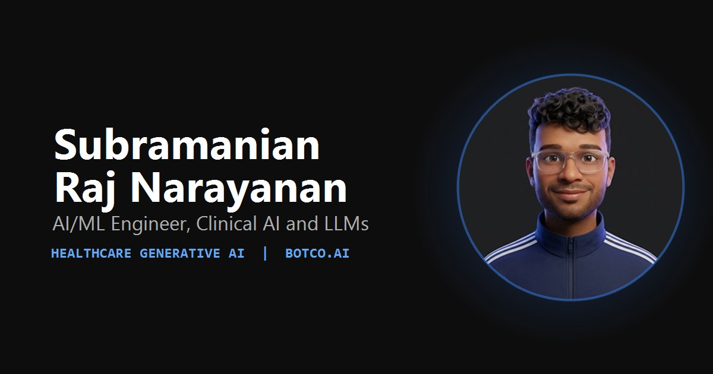

<div align="center">

# Subbu

**AI/ML Engineer · Clinical AI · LLMs**

Personal site of Subramanian Raj Narayanan. Healthcare generative AI, agentic
systems and the production infrastructure that keeps them running.

[**Live site**](https://portfolio-website-five-ashy-63.vercel.app/) ·
[LinkedIn](https://www.linkedin.com/in/subraraj) ·
[GitHub](https://github.com/subra4112)



</div>

---

## What this is

A five page portfolio built around one idea: show the work running, not just
described. Two real products are embedded live in the page, and the 3D field
that used to sit behind the text now does something useful, it carries you
between sections.

| Page | What lives there |
| --- | --- |
| **Home** | Hero, education, work history, the four things I specialize in |
| **Work** | Seven projects. Two of them run live inside the page |
| **Experience** | Botco.ai, Techavidity, SRMIST, with education and leadership |
| **Stack** | 62 tools in floating bubbles. Click any one for a plain explanation |
| **Contact** | A working form, wired to EmailJS |

---

## The interesting parts

**Live product previews.** The Carlton AI clinical dashboard and the Beyfortus
adverse event companion are embedded as real, running pages inside their
project cards. Click one and it opens full screen with the rest of the site
blurred behind it. Both frames are sandboxed and lazy mounted, so a heavy
bundle never blocks the page.

**The transition loader.** Navigating between sections plays a WebGL particle
field that morphs into a shape and colour belonging to the destination: a
lattice for Work, a helix for Experience, a sphere for the Stack. A coloured
panel wipes up, the page swaps behind it unseen, then the curtain lifts. The
three.js chunk is dynamically imported and its render loop parks between
transitions, so it costs nothing at rest.

**The welcome.** The opening avatar was generated from a real photo, then
rendered again with the arm in different positions. Those frames play as
animation cels, and only the hand region blends between them, so the face and
body never shimmer.

**Skills that explain themselves.** Every bubble opens a one sentence
explanation written for someone who is not an ML engineer. *RAG Pipelines: the
model looks up real documents before answering, so it cites facts instead of
inventing them.*

---

## Built with

| | |
| --- | --- |
| **Framework** | React 18, TypeScript, Vite |
| **Routing** | React Router |
| **Styling** | Tailwind CSS on a palette read from ChatGPT's own design tokens |
| **3D** | three.js and React Three Fiber, with custom GLSL |
| **Motion** | Framer Motion |
| **Type** | Sora, Inter, JetBrains Mono, Instrument Serif |
| **Mail** | EmailJS |
| **Hosting** | Vercel |

---

## Running it

```bash
npm install
npm run dev      # http://localhost:5173
npm run build    # type check, then production build to dist
npm run preview  # serve the production build
```

---

## Engineering notes

**Performance.** Vendor code is split into cacheable chunks and three.js sits
alone in its own, behind a dynamic import, so it never touches first paint.
The hero portrait carries explicit dimensions and high fetch priority, fonts
load without blocking render, and static assets are served immutable for a
year.

**Security.** A full header set is applied at the edge in `vercel.json`:
Content Security Policy, HSTS with preload, `nosniff`, frame and referrer
policy, and a Permissions Policy that denies camera, microphone, geolocation,
payment and USB. Both embedded demos run sandboxed. Source maps are disabled in
production. Dependencies are kept at zero known vulnerabilities.

**Accessibility.** Body copy holds roughly 9.5:1 contrast and headings close to
19:1. There is a skip link, every control is reachable by keyboard, popups
close on Escape, and every animation on the site, including the 3D field and
the opening wave, is disabled under `prefers-reduced-motion`.

**Responsive.** Verified at 375, 768, 1024 and 1440 wide with zero horizontal
overflow on every page.

---

<div align="center">

Open to full time AI/ML Engineer, Data Scientist, Clinical AI and Forward
Deployed Engineer roles.

**[rvanush3@gmail.com](mailto:rvanush3@gmail.com)**

</div>
